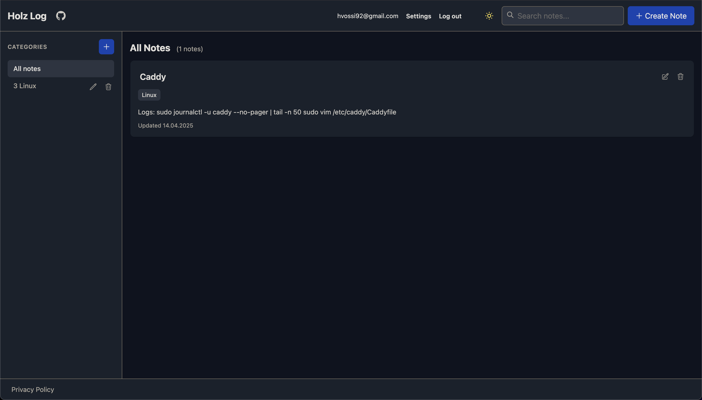

# Holz Log

 <!-- Add a screenshot for visual appeal -->

A lightweight micro-blog built with the Phoenix Framework, inspired by Joplin's note-taking organization. Create, categorize and share markdown notes in a clean, organized interface.

**Live Demo**: [https://holzlog.duckdns.org/](https://holzlog.duckdns.org/)

## Table of Contents

- [For Users](#for-users)
  - [Features](#features)
  - [Using Holz Log](#using-holz-log)
- [For Developers](#for-developers)
  - [Tech Stack](#tech-stack)
  - [Architecture](#architecture)
  - [Database Schema](#database-schema)
  - [Setup and Installation](#setup-and-installation)
  - [Development](#development)
- [Roadmap](#roadmap)

## For Users

### Features

- **Simple Note Management**: Create, edit, view, and organize notes with ease
- **Category Organization**: Assign notes to multiple categories for flexible organization
- **Quick Search**: Find notes by title or content with the built-in search feature
- **Clean Interface**: Minimalist design focused on content readability

### Using Holz Log

1. **Creating Notes**: Click the "Create Note" button in the header to create a new note
2. **Organizing Notes**: Assign categories when creating or editing notes
3. **Finding Notes**: Browse by category using the sidebar, or use the search function
4. **Editing Notes**: Each note has an "Edit" button for quick modifications

## For Developers

### Tech Stack

- **Backend**:

  - [Elixir](https://elixir-lang.org/) (v1.14+)
  - [Phoenix Framework](https://www.phoenixframework.org/) (v1.7+)
  - [Ecto](https://hexdocs.pm/ecto/Ecto.html) - Database abstraction layer
  - [SQLite](https://www.sqlite.org/) - Database (via [ecto_sqlite3](https://hexdocs.pm/ecto_sqlite3))

- **Frontend**:
  - [Phoenix LiveView](https://hexdocs.pm/phoenix_live_view/) - For interactive UI components
  - [Tailwind CSS](https://tailwindcss.com/) - For styling

### Architecture

The application follows Phoenix's standard MVC architecture with LiveView components:

- **Contexts**: Business logic organized into domain-specific modules
- **Schema**: Ecto schemas representing database tables with validations
- **Controllers/LiveViews**: Handle incoming requests and manage state
- **Templates**: Render HTML responses using HEEx templates

#### UI Layout

- **Header**: Site title, create button, search bar
- **Sidebar**: Category navigation
- **Main Content**: Note listing or individual note view

### Database Schema

The application uses a SQLite database with the following structure:

#### notes

```sql
CREATE TABLE notes (
    id INTEGER PRIMARY KEY AUTOINCREMENT,
    title TEXT NOT NULL,
    content TEXT NOT NULL,
    inserted_at DATETIME,
    updated_at DATETIME
);
```

#### categories

```sql
CREATE TABLE categories (
    id INTEGER PRIMARY KEY AUTOINCREMENT,
    name TEXT NOT NULL
);
```

#### note_categories (Join Table)

```sql
CREATE TABLE note_categories (
    note_id INTEGER REFERENCES notes(id),
    category_id INTEGER REFERENCES categories(id),
    PRIMARY KEY (note_id, category_id)
);
```

### Setup and Installation

1. **Prerequisites**:

   - Elixir and Erlang installed ([installation guide](https://elixir-lang.org/install.html))
   - Phoenix Framework installed: `mix archive.install hex phx_new`

2. **Clone and Setup**:

   ```bash
   # Clone the repository
   git clone https://github.com/yourusername/holz_log.git
   cd holz_log

   # Get dependencies
   mix deps.get

   # Setup database
   mix ecto.setup
   ```

3. **Run the Application**:

   ```bash
   # Start Phoenix server
   mix phx.server
   ```

4. Visit [`localhost:4000`](http://localhost:4000) in your browser

### Development

- **Code Format**: `mix format`
- **Start Interactive Console**: `iex -S mix`

## Roadmap

- [x] Basic note creation and management
- [x] Category organization
- [x] Make sure docker compose deployments persist db through new containers
- [ ] Add Earmark dependency for note body
- [ ] Do not list category IDs in frontend
- [ ] Implement database backups (download or email)
- [ ] Change after create & update redirects to go back to main page
- [ ] Increase note preview character limit
